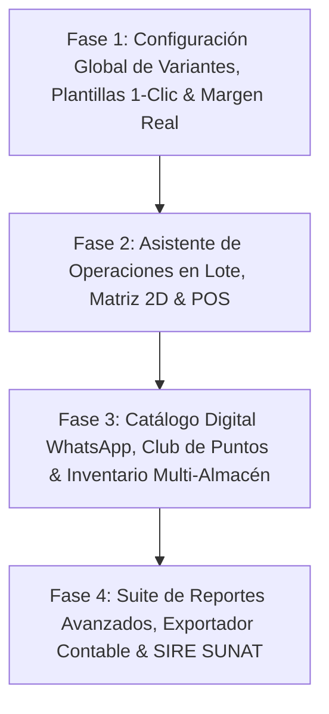

# 🚀 PLAN MAESTRO DE ESPECIFICACIONES E IMPLEMENTACIÓN — HORYTEK ERP
> **Documento de Instrucciones de Alta Precisión para Claude Code / Agente Autónomo**
> **Proyecto**: Horytek ERP (*Proyecto Tormenta*) — Multi-tenant ERP + POS + SUNAT CPE
> **Fecha de Auditoría**: 2026-08-01 | **Versión**: 3.6.0 (Fase 2 ejecutada + sistema de variantes/atributos verificado y extendido contra código real)

---

## 📌 1. ESTADO REAL DEL PROYECTO (AUDITORÍA DE CÓDIGO FUENTE)

### ✅ Lo que ya está completado y NO debe tocarse salvo extensión:
* **Aislamiento Multi-Tenant**: Middleware `auth.middleware.js` inyecta `req.id_tenant` y `req.id_empresa` desde JWT.
* **Modelo de Datos de Variantes SKU**: `producto_sku`, `sku_atributo_valor`, `inventario_stock` por `(id_sku, id_almacen)` en MySQL crudo (`mysql2/promise`).
* **Captura de Costo Promedio en Nota de Ingreso**: `notaingreso.controller.js` ya invoca `aplicarIngresoAlCosto` (`src/services/costos/costoRepository.js`) antes de incrementar el stock.
* **Captura de Costo Histórico al Vender**: `ventas.controller.js` ya consulta `obtenerCostosVigentes` e inserta `costo_unitario` en `detalle_venta`.
* **Emisión SUNAT CPE (Factura/Boleta)**: Módulo `src/services/sunat/` funcional e idempotente.
* **Suite de Pruebas Unitarias Backend**: 112+ tests en `src/services/costos/` y `src/services/sunat/` corriendo con `npm test` en ~1.5s.

---

### ✅ Discrepancia resuelta (2026-07-31): dos implementaciones de "Config. de Variantes"

Existían **dos sistemas sin relación** resolviendo lo mismo. Resolución aplicada:

* **Borrado (sin nada rescatable, ~700 líneas)**: `src/controllers/empresaAtributoConfig.controller.js`, `src/scripts/create_empresa_atributo_config.sql`, `src/scripts/migrate_empresa_atributo_config.js`, su montaje en `empresa.routes.js` (`GET/PUT /api/empresa/atributos-config`), `client-v2/src/store/useVariantConfigStore.ts` y `client-v2/src/features/settings/components/CompanyVariantSettingsTab.tsx`. Trabajaban con una lista fija hardcodeada de 4 códigos (TALLA/COLOR/MATERIAL/TONALIDAD) y nunca estuvieron conectados a ninguna página.
* **Rescatado**: `client-v2/src/components/shared/AdaptiveDataView.tsx` (233 líneas, switcher genérico Cards/Tabla/Matriz) SÍ era reutilizable — su único acoplamiento al sistema muerto era `isAttributeActive(codigo)`, que ya existe con la misma firma en `useAttributeVisibility.ts` (el hook real). Se reconectó ahí; queda como infraestructura genérica lista para usar en cualquier página, aunque todavía ningún módulo la renderiza.
* **Ganador, ahora con superficie completa**: `atributo.es_visible` — el mismo flag que ya filtraba la creación de variantes ahora también tiene una pantalla dedicada: `client-v2/src/features/settings/components/VariantesSettingsCard.tsx`, montada en `SettingsPage.tsx` (Configuración del negocio). Lista los atributos reales del tenant con un switch por atributo, reusando `PUT /api/attributes/:id` — cero tabla y cero endpoint nuevos.

**Extensión (2026-08-01) — colapso de variantes al desactivar un atributo.** Se pidió que desactivar un atributo no solo lo oculte al crear productos, sino que reagrupe las variantes YA EXISTENTES en toda la app (ej. "Rojo+M" y "Azul+M" se ven como una sola fila "M" con el stock sumado, sin tocar los SKU reales). Auditando el código se confirmó que **hoy solo `ViewVariantsModal.tsx` (Productos) muestra SKUs individuales con sus atributos** — Inventario (`KardexDetalle.tsx`, `KardexStockMinimo.tsx`) y Reportes (`MargenPage.tsx`) están agregados a nivel de producto, sin desglose por atributo, así que no hay nada que colapsar ahí todavía.

Entregado (solo lectura, cero cambios en la venta/stock):
* `client-v2/src/lib/variantCollapse.ts` — función pura `collapseVariants()`, agrupa SKUs por sus atributos activos y suma stock. Testeada (`variantCollapse.test.ts`, 4 casos).
* `useAttributeVisibility.ts` ahora expone `activeAttributeIds` (memoizado).
* `ViewVariantsModal.tsx` usa la vista colapsada en la tabla de stock por variante; el precio se muestra como "Varía" si el grupo mezcla SKUs con precios distintos. La impresión de etiquetas sigue usando los SKUs reales sin colapsar (cada etiqueta necesita su EAN-13 físico).

**Explícitamente NO construido en esta pasada** (Fase B, requiere tocar `ventas.controller.js` de nuevo): que el POS/Compras puedan operar sobre una "variante colapsada" repartiendo automáticamente el stock entre los SKU reales que agrupa. Se decidió esperar a que Fase A esté probada en producción antes de tocar la ruta de dinero otra vez.

**Extensión (2026-08-01) — 4 brechas reales del pedido "sistema universal de variantes".** Se comparó un spec ambicioso (Prisma, IDs cuid, modelo `Attribute`/`ProductVariant` nuevo) contra el modelo real (MySQL crudo, `atributo`/`atributo_valor`/`producto_sku`/`sku_atributo_valor` ya cubren ~80% 1:1). De las 4 brechas genuinas identificadas, se construyeron las 4:
* **Orden de atributos/valores**: `atributo.orden` y `atributo_valor.orden` (antes se listaban por id de inserción). Botones subir/bajar en `VariantesSettingsCard.tsx` y `AttributeValuesPanel.tsx`. Endpoints `PUT /attributes/reorder` y `PUT /attributes/:id/values/reorder`.
* **`AttributeImpactDialog`**: antes de desactivar un atributo, `GET /attributes/:id/impact` cuenta productos/variantes/plantillas de categoría/líneas de venta que lo usan (solo lectura sobre `sku_atributo_valor`). Modal en `VariantesSettingsCard.tsx`; reactivar no pide confirmación, solo desactivar.
* **Matriz N-dimensional (3+ atributos)**: el backend (`generateSKUs`) ya no tenía límite de dimensiones — el límite era 100% frontend. `MatrixVariantGrid.tsx` (2D) queda intacta; `VariantTableBuilder.tsx` nuevo cubre 3+ como tabla plana con precio/stock por combinación, sobre el mismo cartesiano puro (`variantMatrix.ts`, testeado). `VariantPicker.tsx` (POS/Compras/Notas) ahora es realmente en cascada: cada atributo acota sus opciones a lo que ya sigue siendo alcanzable, no solo con 2 dimensiones.
* **Snapshot literal de atributos en ventas**: `detalle_venta.atributos_snapshot` (JSON) — copia `{id_atributo, nombre, valor}` al momento de vender, para que un renombre futuro de un valor no reescriba silenciosamente el histórico. Ventas anteriores a la migración quedan en `NULL` (no se reconstruyen retroactivamente).

---

### ❌ Lo que FALTA por implementar (Objetivo del Plan):

1. ✅ **Motor Útil de Plantillas de Atributos por Categoría (Presets de 1 Clic)**:
   * Las plantillas en Configuración > Contenido > Plantillas (`CategoryTemplates.tsx`) ya están conectadas directamente al formulario de creación de productos (`ProductForm.tsx`). Al seleccionar una categoría, se filtran y aplican automáticamente los atributos linkeados en su plantilla (con fallback inteligente a todos los atributos del sistema si la categoría no tiene plantilla asignada). **Completo y funcional.**
2. ⚠️ **Suite Avanzada de Bloques Funcionales de Reportes (`client-v2/src/features/reports`)**:
   * *Bloque 1* Margen Bruto Real: el archivo `GrossMarginReport.tsx` del plan está huérfano (ver discrepancia arriba), pero el mismo objetivo de negocio SÍ se entregó por otra vía: `client-v2/src/features/costos/components/{MargenBarChart,BcgMatrix}.tsx`, wireados y visibles en `MargenPage.tsx` (margen por prenda + matriz BCG).
   * *Bloque 4* Cuadre de medios de pago: cubierto parcialmente por el nuevo Arqueo de Caja (ver más abajo) — compara declarado vs. esperado por método (Efectivo/Yape/Plin/Tarjeta), pero vive en el POS, no como reporte gerencial en `features/reports`.
   * *Bloques 2, 3, 5, 6* (Aging de stock, Heatmap de horas pico, UPT por vendedor, exportación 1-clic Excel/PDF/CSV): **no iniciados.**
3. ⚠️ **Componente Reutilizable Global de Visualización Adaptativa (`AdaptiveDataView`)**:
   * Ya reconectado a datos reales (`useAttributeVisibility` en vez del store muerto) — funcional y listo para usar, pero **ningún módulo lo renderiza todavía**. Falta adoptarlo en alguna página real (candidatos: `ProductTable.tsx`, listados de inventario) para que deje de ser infraestructura sin consumidor.
4. ❌ **Asistente Seguro de Operaciones en Lote (`BatchOperationWizard.tsx`)**:
   * Modal guiado en 4 pasos con previsualización explícita del cambio antes de guardar en la base de datos. **No iniciado.**
5. ✅ **Matriz 2D Talla × Color y Generador/Impresor de Códigos de Barras**:
   * `MatrixVariantGrid.tsx` (alta masiva 2D, wireado en `ProductForm.tsx`) + generador EAN-13 (`generarEan13` en `skuHelper.js`, GS1 rango 20-29) + impresión de etiquetas térmicas 50×30/30×20mm (`PrintLabelsDialog.tsx`, wireado en `ViewVariantsModal.tsx`). **Completo.**
6. ❌ **Módulo Catálogo Digital & Pedidos WhatsApp (`client-v2/src/features/catalog-express`)**:
   * Vitrina web pública por tenant con sincronización de inventario en tiempo real y envío de pedido a WhatsApp. **No iniciado.**
7. ✅ **Módulo de Comisiones y Rendimiento de Vendedores**:
   * Ya existe y funciona — `ComisionesPanel.tsx` en `client-v2/src/features/employees/` (no en `features/commissions` como sugería el plan), calcula comisión = ventas atribuidas × `vendedor.porcentaje_comision`, wireado en `EmployeesPage.tsx`.
8. ❌ **Módulo de Fidelización y Club de Puntos (`client-v2/src/features/loyalty`)**:
   * Acumulación de puntos por compras y canje directo en la caja del POS. **No iniciado.**
9. ⚠️ **Módulo de Cambios de Talla/Color y Devoluciones en POS**:
   * El wizard de cambio/devolución (`ReturnWizard.tsx`) ya existía completo; esta sesión solo le agregó un atajo directo desde la venta activa en el POS (antes solo se llegaba navegando a `/sales/returns` y se perdía el carrito). La **emisión automática de Nota de Crédito SUNAT sigue sin construirse — decisión explícita**: mismo nivel de riesgo regulatorio que Nota de Débito, requiere spec oficial SUNAT antes de tocarlo.
10. ❌ **Exportador a Software Contables Peruanos (CONCAR, SISCONT, FOXCONT) & SIRE SUNAT**:
    * Generador de archivos de importación contable y estructuras TXT oficiales del Registro de Ventas e Ingresos Electrónicos (RVIE/RCE). **No iniciado** (no confundir con la capa de datos SIRE de solo-lectura hecha en una sesión anterior sobre `PLAN_TRABAJO_SOCIO.md` — ese trabajo tampoco incluye el generador de TXT oficial, deliberadamente, por el mismo motivo regulatorio).

---

### ✅ Entregado esta sesión, fuera de la lista literal del plan (sustituto acordado para "Fase 2")

Al ejecutar Fase 2 se verificó que **Nota de Crédito automática** cae en el mismo nivel de riesgo regulatorio ya rechazado antes para Nota de Débito, así que en vez de eso se acordó contigo (vía preguntas de alcance) construir 4 mejoras seguras y acotadas que sí quedaron completas y verificadas contra la base real:

* **N° de operación Yape/Plin**: `venta.referencia_pago` (columna nueva), capturado en `PaymentModal.tsx`.
* **Atajo POS → cambio/devolución**: ver ítem 9 arriba.
* **Código de barras EAN-13 + impresión de etiquetas**: ver ítem 5 arriba.
* **Combos/Kits de productos**: `producto.es_combo` + tabla `combo_item`, descuento de stock multinivel por componente real (no del combo), disponibilidad calculada en el catálogo POS, costo/margen del combo como suma ponderada de sus componentes. Editor de composición en `ProductForm.tsx` vía `ComboItemsEditor.tsx`.
* **Arqueo de caja por turno**: tabla nueva `caja_turno`, apertura con fondo inicial, cierre con conteo ciego por método de pago (el "esperado" se calcula recién después de que el cajero declara), widget en el header del POS (`TurnoCajaWidget.tsx`). Independiente de Tesorería (que cierra a nivel de día completo del negocio, no por turno de cajero).

---

## 📌 2. REGLAS INVIOLABLES DE ARQUITECTURA

1. **Multi-Tenant Estricto**: Toda consulta SQL DEBE incluir `WHERE id_tenant = ?` (y `id_empresa = ?` si aplica) obtenido exclusivamente de `req.id_tenant` / `req.id_empresa`.
2. **SQL Parametrizado Siempre**: Usar placeholders `?` con `connection.query(sql, params)`. Prohibido concatenar variables.
3. **Gestión de Conexiones**: Liberar **SIEMPRE** con `connection.release()` en `finally`.
4. **Respuestas HTTP Estandarizadas**: `{ success: true, data }` en éxito y `{ success: false, message }` en error.
5. **Preservar Tests Existentes**: Ejecutar `npm test` antes de commit.

---

## 🏗️ 3. ESPECIFICACIÓN DETALLADA DE IMPLEMENTACIÓN

### 📊 MÓDULO 1: Suite Avanzada de Reportes (`client-v2/src/features/reports`)
* **`GrossMarginReport.tsx`**: Margen bruto real, ganancia neta en S/ y % sobre ventas, indicador de cobertura.
* **`StockAgingReport.tsx`**: Antigüedad de inventario (0-30d, 31-60d, 61-90d, 90d+) con sugerencias de liquidación.
* **`SalesHeatmapReport.tsx`**: Mapa de calor por hora del día y día de la semana para optimizar turnos de caja.
* **`PaymentMethodsReport.tsx`**: Auditoría y comparativa Efectivo vs Yape vs Plin vs Tarjeta.
* **`SellerPerformanceReport.tsx`**: Ticket promedio, prendas por ticket (UPT) y comisiones acumuladas.
* **Exportador Excel / PDF**: Utilidad `reportExporter.ts` para descarga estructurada en 1 clic.

---

### 🎛️ MÓDULO 2: Motor de Configuración Global de Variantes — SUPERADO, no construir así
* ~~DDL SQL idempotente `create_empresa_atributo_config.sql`~~ / ~~Endpoints `GET/PUT /api/empresa/atributos-config`~~ / ~~Store `useVariantConfigStore.ts`~~ — este enfoque (tabla nueva + lista fija de códigos) se construyó, quedó huérfano y se **borró** el 2026-08-01.
* Lo real y vivo es `atributo.es_visible` (+ `orden`) sobre los atributos reales del tenant, expuesto en `VariantesSettingsCard.tsx`. Ver "Discrepancia resuelta" en la §1.

---

### 🛡️ MÓDULO 3: Asistente Seguro de Operaciones en Lote (`BatchOperationWizard.tsx`)
* Modal guiado en 4 pasos con previsualización explícita del cambio antes de guardar en la base de datos.

---

### 🎨 MÓDULO 4: Visualización Adaptativa `AdaptiveDataView` & Matriz 2D
* Componente reutilizable con conmutador de Layouts (Cards, Matrix 2D, Tabla Densa).
* Grilla 2D `MatrixVariantGrid.tsx` + impresor de códigos de barras.

---

### 📱 MÓDULO 5: Catálogo Digital & Pedidos WhatsApp (`catalog-express`)
* Vitrina web pública por tenant con carrito y envío de pedido a WhatsApp.

---

### 📜 MÓDULO 6: Exportador Contable (CONCAR/SISCONT) & SIRE SUNAT
* Generación de archivos TXT RVIE/RCE para SUNAT y asientos para software contables peruanos.

---

## 🗓️ 4. CRONOGRAMA DE EJECUCIÓN POR FASES



### 🔹 Fase 1 (Semanas 1-2) — Variantes Dinámicas, Plantillas 1-Clic & Margen Real
- [x]⚠️ DDL `create_empresa_atributo_config.sql`, API `/api/empresa/atributos-config` y store Zustand `useVariantConfigStore.ts` — **existen pero están huérfanos, sin UI que los use** (ver "Discrepancia detectada" arriba). El toggle de atributos que sí funciona hoy es otro camino: `atributo.es_visible` + `useAttributeVisibility.ts`.
- [ ] Implementar el Motor Útil de Plantillas de Atributos (`AttributeTemplateManager.tsx`).
- [x]⚠️ Desarrollar `AdaptiveDataView.tsx` (Cards, Matrix, Tabla) en `client-v2/src/components/shared/` — existe (233 líneas) pero no está importado en ninguna página.
- [x]⚠️ Crear el reporte de Margen Bruto Real — el archivo `GrossMarginReport.tsx` está huérfano, pero el objetivo se cumplió por otra vía: `MargenBarChart.tsx` + `BcgMatrix.tsx`, sí wireados en `MargenPage.tsx`.

### 🔹 Fase 2 (Semanas 3-4) — Asistente de Operaciones en Lote, Matriz 2D & POS
- [ ] Crear `BatchOperationWizard.tsx` (Modal guiado paso a paso con previsualización).
- [x] Crear `MatrixVariantGrid.tsx` y generador/impresor de etiquetas de código de barras — completo (EAN-13 + `PrintLabelsDialog.tsx`).
- [x]⚠️ Cambios de prenda accesibles desde el POS — atajo agregado a `ReturnWizard.tsx` existente. La Nota de Crédito automatizada **NO se construyó** (riesgo regulatorio, requiere spec oficial SUNAT).
- [x] Módulo de Comisiones de Vendedores — ya existía como `ComisionesPanel.tsx` en `features/employees/`, no en `features/commissions`.
- [x] *(sustituto acordado, fuera de la lista original)* N° de operación Yape/Plin, Combos/Kits con descuento de stock multinivel, Arqueo de caja por turno de cajero.

### 🔹 Fase 2.5 (2026-08-01) — Sistema de Variantes/Atributos: verificación + 4 brechas reales (fuera de la lista original)
- [x] Colapso de variantes al desactivar un atributo (`variantCollapse.ts`) en `ViewVariantsModal.tsx` — solo lectura, Inventario/Reportes no tienen vista por SKU que colapsar todavía.
- [x] Orden (`orden`) en `atributo`/`atributo_valor` con botones subir/bajar.
- [x] `AttributeImpactDialog` — impacto (productos/variantes/plantillas/ventas) antes de desactivar.
- [x] Matriz N-dimensional (3+ atributos): `VariantTableBuilder.tsx` + `VariantPicker.tsx` en cascada real.
- [x] Snapshot literal de atributos en `detalle_venta.atributos_snapshot`.
- [ ] Fase B pendiente (no confirmada): POS/Compras operando sobre una "variante colapsada" con reparto automático de stock — toca `ventas.controller.js` otra vez.

### 🔹 Fase 3 (Semanas 5-6) — Catálogo Digital WhatsApp, Puntos & Inventario
- [ ] Desarrollar Catálogo Digital Público & Pedidos por WhatsApp (`catalog-express`).
- [ ] Implementar Módulo de Fidelización y Club de Puntos (`loyalty`).
- [ ] Implementar `inventoryMovement.service.js` para transferencias guiadas e inventario físico ciego.

### 🔹 Fase 4 (Semanas 7-8) — Suite de Reportes Avanzados, Exportador Contable & SIRE SUNAT
- [ ] Implementar `StockAgingReport.tsx` (Antigüedad de Stock y Rotación).
- [ ] Implementar `SalesHeatmapReport.tsx` (Mapa de calor de horas pico).
- [ ] Implementar `PaymentMethodsReport.tsx` y `SellerPerformanceReport.tsx`.
- [ ] Implementar `sire.service.js` y exportador a CONCAR, SISCONT y FOXCONT.
- [ ] Crear `VariantConfigDebugTab.tsx` en la sección de Desarrollador.

---

## 🧪 5. VERIFICACIÓN Y COMANDOS DE CONTROL

1. **Ejecutar Tests Unitarios (Backend)**:
   ```bash
   npm test
   ```
   *Debe correr los 112+ tests en ~1.5 segundos en verde.*

2. **Validar Matriz de Autorización (RBAC)**:
   ```bash
   node scripts/validate-authz.js
   ```
   *Debe dar 0 errores críticos.*
