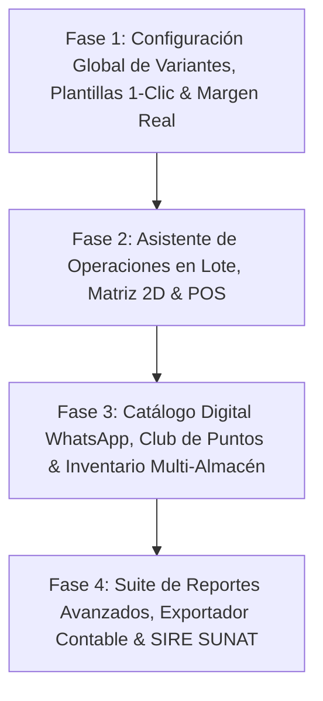

# 🚀 PLAN MAESTRO DE ESPECIFICACIONES E IMPLEMENTACIÓN — HORYTEK ERP
> **Documento de Instrucciones de Alta Precisión para Claude Code / Agente Autónomo**
> **Proyecto**: Horytek ERP (*Proyecto Tormenta*) — Multi-tenant ERP + POS + SUNAT CPE
> **Fecha de Auditoría**: 2026-08-01 | **Versión**: 3.10.0 (Exportador contable, Throttle SUNAT global, Modo offline en el POS y Fase B de variantes colapsadas — todo lo pendiente del plan queda cerrado salvo lo declinado por riesgo regulatorio y los bloqueos externos)

---

## 📌 1. ESTADO REAL DEL PROYECTO (AUDITORÍA DE CÓDIGO FUENTE)

### ✅ Lo que ya está completado y NO debe tocarse salvo extensión:
* **Aislamiento Multi-Tenant**: Middleware `auth.middleware.js` inyecta `req.id_tenant` y `req.id_empresa` desde JWT.
* **Modelo de Datos de Variantes SKU**: `producto_sku`, `sku_atributo_valor`, `inventario_stock` por `(id_sku, id_almacen)` en MySQL crudo (`mysql2/promise`).
* **Captura de Costo Promedio en Nota de Ingreso**: `notaingreso.controller.js` ya invoca `aplicarIngresoAlCosto` (`src/services/costos/costoRepository.js`) antes de incrementar el stock.
* **Captura de Costo Histórico al Vender**: `ventas.controller.js` ya consulta `obtenerCostosVigentes` e inserta `costo_unitario` en `detalle_venta`.
* **Emisión SUNAT CPE (Factura/Boleta)**: Módulo `src/services/sunat/` funcional e idempotente.
* **Operaciones exoneradas/inafectas en el builder UBL**: `ublInvoiceBuilder.js` ya arma `mtoOperExoneradas`/`mtoOperInafectas` además de gravadas (antes solo gravadas). Falta una prueba en vivo contra el ambiente beta de SUNAT para confiarlo del todo en producción — ver bloqueo de credenciales más abajo.
* **Suite de Pruebas Unitarias Backend**: 112+ tests en `src/services/costos/` y `src/services/sunat/` corriendo con `npm test` en ~1.5s.
* **Código de barras por SKU**: `codigoBarrasSku()` se llama en los 3 puntos de creación de SKU — ya no queda `producto_sku.cod_barras` en `NULL` para SKUs nuevos. Extendido esta sesión con EAN-13 real + impresión de etiquetas.
* **Costo en la nota de ingreso**: `notaingreso.controller.js` aplica `aplicarIngresoAlCosto` antes de incrementar stock, agrupado por SKU, solo en ingresos reales (no traslados). UI de captura en `NoteFormDialog.tsx` con vocabulario dinámico desde `GET /api/negocio` (`origen_vocabulario.campoCosto/ayudaCosto`) y selector de origen solo si la empresa es MIXTO.
* **Ciclo de compra completo**: antes era "cero tablas de compras" — hoy existen `ordenCompra`, `facturaCompra`, `cuentaPorPagar`, `anticipoProveedor` (backend montado en `/api/compras/*`) con su frontend completo en `client-v2/src/features/purchases/` (órdenes, facturas, cuentas por pagar, anticipos).

---

### ✅ Discrepancia resuelta (2026-07-31): dos implementaciones de "Config. de Variantes"

Existían **dos sistemas sin relación** resolviendo lo mismo. Resolución aplicada:

* **Borrado (sin nada rescatable, ~700 líneas)**: `src/controllers/empresaAtributoConfig.controller.js`, `src/scripts/create_empresa_atributo_config.sql`, `src/scripts/migrate_empresa_atributo_config.js`, su montaje en `empresa.routes.js` (`GET/PUT /api/empresa/atributos-config`), `client-v2/src/store/useVariantConfigStore.ts` y `client-v2/src/features/settings/components/CompanyVariantSettingsTab.tsx`. Trabajaban con una lista fija hardcodeada de 4 códigos (TALLA/COLOR/MATERIAL/TONALIDAD) y nunca estuvieron conectados a ninguna página.
* **Rescatado**: `client-v2/src/components/shared/AdaptiveDataView.tsx` (233 líneas, switcher genérico Cards/Tabla/Matriz) SÍ era reutilizable — su único acoplamiento al sistema muerto era `isAttributeActive(codigo)`, que ya existe con la misma firma en `useAttributeVisibility.ts` (el hook real). Se reconectó ahí; queda como infraestructura genérica lista para usar en cualquier página, aunque todavía ningún módulo la renderiza.
* **Ganador, ahora con superficie completa**: `atributo.es_visible` — el mismo flag que ya filtraba la creación de variantes ahora también tiene una pantalla dedicada: `client-v2/src/features/settings/components/VariantesSettingsCard.tsx`, montada en `SettingsPage.tsx` (Configuración del negocio). Lista los atributos reales del tenant con un switch por atributo, reusando `PUT /api/attributes/:id` — cero tabla y cero endpoint nuevos.

**Extensión (2026-08-01) — colapso de variantes al desactivar un atributo.** Se pidió que desactivar un atributo no solo lo oculte al crear productos, sino que reagrupe las variantes YA EXISTENTES en toda la app (ej. "Rojo+M" y "Azul+M" se ven como una sola fila "M" con el stock sumado, sin tocar los SKU reales). Auditando el código se confirmó que **hoy solo `ViewVariantsModal.tsx` (Productos) muestra SKUs individuales con sus atributos** — Inventario (`KardexDetalle.tsx`, `KardexStockMinimo.tsx`) y Reportes (`MargenPage.tsx`) están agregados a nivel de producto, sin desglose por atributo, así que no hay nada que colapsar ahí todavía.

Entregado (solo lectura, cero cambios en la venta/stock):
* `client-v2/src/lib/variantCollapse.ts` — función pura `collapseVariants()`, agrupa SKUs por sus atributos activos y suma stock. Testeada (`variantCollapse.test.ts`, 4 casos).
* `useAttributeVisibility.ts` ahora expone `activeAttributeIds` (memoizado).
* `ViewVariantsModal.tsx` usa la vista colapsada en la tabla de stock por variante; el precio se muestra como "Varía" si el grupo mezcla SKUs con precios distintos. La impresión de etiquetas sigue usando los SKUs reales sin colapsar (cada etiqueta necesita su EAN-13 físico).

**Fase B (2026-08-01) — construida y verificada.** El POS ahora puede vender sobre una "variante colapsada": en `VariantPicker.tsx` (prop `permitirColapsada`, hoy solo activada en el POS) cada atributo tiene un botón extra "Cualquiera" — si el cajero fija talla=M y deja color en "Cualquiera", el carrito manda `atributos_fijados: {"<id_atributo_talla>":"M"}` en vez de un `id_sku`. `descontarPorProducto` (`stockRepository.js`) ahora acepta un filtro `atributosFijados` opcional que acota las candidatas por `JSON_EXTRACT(attributes_json, ...)` antes de repartir — mismo motor de reparto/locking que ya usaba el pool sin filtrar, solo con el WHERE más angosto. `ventas.controller.js` gana una rama nueva entre "SKU exacto" y "pool completo del producto". Igual que el pool sin filtrar ya existente, `detalle_venta.id_sku` queda `NULL` en este caso (no hay un único SKU "correcto" que fotografiar); el rastro exacto de qué SKU real perdió stock queda en `bitacora_nota`, como siempre. Verificado con datos reales en una transacción con rollback: filtro por talla=28 sobre un producto con colores Azul/Hielo solo tocó los SKU de esa talla, dejando las otras tallas intactas.

**Extensión (2026-08-01) — 4 brechas reales del pedido "sistema universal de variantes".** Se comparó un spec ambicioso (Prisma, IDs cuid, modelo `Attribute`/`ProductVariant` nuevo) contra el modelo real (MySQL crudo, `atributo`/`atributo_valor`/`producto_sku`/`sku_atributo_valor` ya cubren ~80% 1:1). De las 4 brechas genuinas identificadas, se construyeron las 4:
* **Orden de atributos/valores**: `atributo.orden` y `atributo_valor.orden` (antes se listaban por id de inserción). Botones subir/bajar en `VariantesSettingsCard.tsx` y `AttributeValuesPanel.tsx`. Endpoints `PUT /attributes/reorder` y `PUT /attributes/:id/values/reorder`.
* **`AttributeImpactDialog`**: antes de desactivar un atributo, `GET /attributes/:id/impact` cuenta productos/variantes/plantillas de categoría/líneas de venta que lo usan (solo lectura sobre `sku_atributo_valor`). Modal en `VariantesSettingsCard.tsx`; reactivar no pide confirmación, solo desactivar.
* **Matriz N-dimensional (3+ atributos)**: el backend (`generateSKUs`) ya no tenía límite de dimensiones — el límite era 100% frontend. `MatrixVariantGrid.tsx` (2D) queda intacta; `VariantTableBuilder.tsx` nuevo cubre 3+ como tabla plana con precio/stock por combinación, sobre el mismo cartesiano puro (`variantMatrix.ts`, testeado). `VariantPicker.tsx` (POS/Compras/Notas) ahora es realmente en cascada: cada atributo acota sus opciones a lo que ya sigue siendo alcanzable, no solo con 2 dimensiones.
* **Snapshot literal de atributos en ventas**: `detalle_venta.atributos_snapshot` (JSON) — copia `{id_atributo, nombre, valor}` al momento de vender, para que un renombre futuro de un valor no reescriba silenciosamente el histórico. Ventas anteriores a la migración quedan en `NULL` (no se reconstruyen retroactivamente).

---

### Ítem por ítem del plan original (todo lo accionable por código está cerrado — ver §"Bloqueos externos" y los 2 ítems declinados por riesgo regulatorio):

1. ✅ **Motor Útil de Plantillas de Atributos por Categoría (Presets de 1 Clic)**:
   * Las plantillas en Configuración > Contenido > Plantillas (`CategoryTemplates.tsx`) ya están conectadas directamente al formulario de creación de productos (`ProductForm.tsx`). Al seleccionar una categoría, se filtran y aplican automáticamente los atributos linkeados en su plantilla (con fallback inteligente a todos los atributos del sistema si la categoría no tiene plantilla asignada). **Completo y funcional.**
   * **Presets de industria (2026-08-01)**: 3 botones de 1 clic ("Ropa Textil", "Calzado", "Accesorios") en `CategoryTemplates.tsx` que matchean por *nombre* (no por id, cada tenant tiene los suyos) contra los atributos ya creados y los marca de una — sin crear atributos nuevos por sorpresa: si el tenant no tiene "Material" creado, avisa cuál falta en vez de inventarlo solo.
2. ✅ **Suite Avanzada de Bloques Funcionales de Reportes (`client-v2/src/features/reports`)**:
   * *Bloque 1* Margen Bruto Real: el archivo `GrossMarginReport.tsx` del plan está huérfano (ver discrepancia arriba), pero el mismo objetivo de negocio SÍ se entregó por otra vía: `client-v2/src/features/costos/components/{MargenBarChart,BcgMatrix}.tsx`, wireados y visibles en `MargenPage.tsx` (margen por prenda + matriz BCG).
   * *Bloque 2* Antigüedad de Stock (`StockAgingReport.tsx`, nuevo): clasifica 0-30/31-60/61-90/90+ días desde la última entrada REAL de stock (`detalle_nota`+`nota`, `id_almacenO IS NULL` = ingreso, no traslado; fallback a `producto_sku.f_creacion` si el SKU nunca tuvo nota). **Bug encontrado y corregido en la verificación**: `nota.estado_nota` está invertido respecto a `venta.estado_venta` — `0` es vigente, `1` es anulada (confirmado contra el uso real en `notaingreso.controller.js`); el filtro inicial lo tenía al revés y no traía ningún dato. Verificado con datos reales: 118 productos con stock, distribuidos en sus rangos correctos.
   * *Bloque 3* Horas Pico (`SalesHeatmapReport.tsx`, nuevo): mapa de calor por hora × día de la semana (`DAYOFWEEK`/`HOUR` sobre `venta.f_venta`/`hora_creacion`), escala secuencial de un solo tono (no arcoíris — es magnitud, no categorías).
   * *Bloque 4* Cuadre de medios de pago: sigue cubierto solo parcialmente por el Arqueo de Caja del POS (declarado vs. esperado por método), no como reporte gerencial en `features/reports` — **no se duplicó**, ya cumple el objetivo de negocio en el lugar donde se usa (al cerrar turno).
   * *Bloque 5* Rendimiento y UPT por Vendedor (`SellerPerformanceReport.tsx`, nuevo): unidades por ticket y ticket promedio, reusando `getComisiones` (`vendedores.controller.js`) — se le agregó `unidades_vendidas`/`upt`/`ticket_promedio` al SELECT existente en vez de duplicar el join venta↔vendedor↔detalle_venta.
   * *Bloque 6* Exportación 1-clic: `client-v2/src/lib/reportExporter.ts` (CSV/Excel/PDF, con `jspdf`/`xlsx` ya instalados — cero dependencias nuevas) + `ExportReportButton.tsx` reusable, wireado en los 3 reportes nuevos.
   * Todas las consultas nuevas verificadas contra datos reales o, donde `venta` está vacía en este entorno (heatmap, vendedores), verificadas estructuralmente (ejecutan sin error, devuelven 0 filas correctamente — el frontend ya maneja el estado vacío).
3. ✅ **Componente Reutilizable Global de Visualización Adaptativa (`AdaptiveDataView`)**:
   * Adoptado en `KardexStockMinimo.tsx` (Inventario > Stock crítico) — reemplaza la tabla fija por el switcher Cards/Tabla y de paso agrega búsqueda por nombre/marca, que la página no tenía. `ProductTable.tsx` queda sin tocar (ya tiene sus propias features, migrarla es un refactor de mayor riesgo, no una "cosa chica"). **Completo, con consumidor real.**
4. ✅ **Asistente Seguro de Operaciones en Lote (`BatchOperationWizard.tsx`)**:
   * Modal de 4 pasos (seleccionar → elegir operación → previsualizar → confirmar) sobre productos: ajuste de precio (%/monto fijo, con log de historial reusando `logProductos.cambioPrecio`), reasignar categoría/marca, activar/desactivar. Endpoint `POST /productos/batch`, wireado en `ProductsPanel.tsx` junto a los botones rápidos existentes (que se dejaron intactos). Preview 100% cliente, sin ida y vuelta al backend. **Completo.**
5. ✅ **Matriz 2D Talla × Color y Generador/Impresor de Códigos de Barras**:
   * `MatrixVariantGrid.tsx` (alta masiva 2D, wireado en `ProductForm.tsx`) + generador EAN-13 (`generarEan13` en `skuHelper.js`, GS1 rango 20-29) + impresión de etiquetas térmicas 50×30/30×20mm (`PrintLabelsDialog.tsx`, wireado en `ViewVariantsModal.tsx`). **Completo.**
6. ✅ **Módulo Catálogo Digital & Pedidos WhatsApp (`client-v2/src/features/catalog-express`)**:
   * Vitrina pública sin login en `/catalogo/:idTenant` (`GET /api/catalogo/:id_tenant`, sin `auth`, solo expone descripción/precio/imagen/stock — nada de costos ni datos internos de `empresa`). Todos los productos activos con stock > 0. Carrito en memoria del navegador (sin persistir en servidor) + botón "Enviar pedido por WhatsApp" que arma un enlace `wa.me` con el pedido formateado, usando el teléfono del negocio (normalizado a +51). **Verificado en navegador de punta a punta contra datos reales** (100+ productos de un tenant real, agregar al carrito, enlace WhatsApp con mensaje y monto correctos). Encontrado y corregido en la verificación: `precio` llega como string desde MySQL (DECIMAL vía mysql2) — se normaliza a number en la capa de API.
7. ✅ **Módulo de Comisiones y Rendimiento de Vendedores**:
   * Ya existe y funciona — `ComisionesPanel.tsx` en `client-v2/src/features/employees/` (no en `features/commissions` como sugería el plan), calcula comisión = ventas atribuidas × `vendedor.porcentaje_comision`, wireado en `EmployeesPage.tsx`.
8. ✅ **Módulo de Fidelización y Club de Puntos (`client-v2/src/features/loyalty`)**:
   * Tablas `puntos_config` (1 fila/tenant: activo, soles por punto, valor de canje por punto) + `cliente.puntos_saldo` (cache) + `puntos_movimiento` (ledger GANADO/CANJEADO, auditable). Ganar puntos es un paso de bookkeeping después de la venta (nunca puede tumbar el cobro); canjear reutiliza el mecanismo YA EXISTENTE de `venta.descuento_global` (el backend nunca recalculaba el total desde ahí, solo lo auditaba — el canje solo mueve el saldo del cliente con la misma confianza que ya se le daba a un descuento manual). Rechaza canjes por encima del saldo disponible (`PuntosInsuficientesError`, 409, mismo patrón que `StockInsuficienteError`). Tarjeta de configuración en `SettingsPage.tsx`; en el POS (`PaymentModal.tsx`) se muestra el saldo del cliente seleccionado y un botón "Canjear". **Verificado con datos reales en una transacción con rollback**: ganar 10 puntos por S/105 a 10 soles/punto, canjear 4, rechazo correcto de un canje de 1000 sobre un saldo de 6.
9. ⚠️ **Módulo de Cambios de Talla/Color y Devoluciones en POS**:
   * El wizard de cambio/devolución (`ReturnWizard.tsx`) ya existía completo; esta sesión solo le agregó un atajo directo desde la venta activa en el POS (antes solo se llegaba navegando a `/sales/returns` y se perdía el carrito). La **emisión automática de Nota de Crédito SUNAT sigue sin construirse — decisión explícita**: mismo nivel de riesgo regulatorio que Nota de Débito, requiere spec oficial SUNAT antes de tocarlo.
10. ✅ **Exportador a Software Contables Peruanos (CONCAR, SISCONT, FOXCONT)**:
    * `src/services/contabilidad/exportadorContable.js` (3 generadores puros, sin dependencias nuevas) + `GET /contabilidad/asientos/exportar?formato=concar|siscont|foxcont` (reusa la misma consulta que ya arma `getLibroDiario`, sin duplicar el join asiento↔cuenta). Botón "Exportar contable" en `JournalBookPanel.tsx` junto al Excel existente. Sin spec oficial de estos 3 formatos (a diferencia de SUNAT no hay XSD público): se documentó en el código que, a diferencia de un CPE mal formado, un TXT de importación contable mal formado solo falla la carga y se corrige a mano — no es multa/sanción — así que se pudo construir sobre el layout estándar de columnas (fecha, cuenta, debe, haber, glosa, documento) sin la misma cautela regulatoria. **El generador de TXT oficial RVIE/RCE (SIRE SUNAT) sigue sin construirse, deliberadamente** — mismo riesgo regulatorio que Nota de Crédito/Débito, no se confunde con este exportador.
11. ✅ **Modo offline (POS)**:
    * Service worker (`client-v2/public/sw.js`, hand-rolled, sin `vite-plugin-pwa`) cachea el app shell en tiempo de ejecución (cache-first para JS/CSS, network-first con fallback a caché para navegación) — cubre "reabrir el POS sin internet después de haber entrado una vez online"; no hay precache real de la primera visita (upgrade path documentado en el propio archivo). `manifest.webmanifest` para instalar como PWA. Cola local: `client-v2/src/lib/offlineOutbox.ts` (IndexedDB nativo, sin dependencia nueva) guarda la venta con la misma `idempotency_key` que ya viajaba en el payload — el backend ya deduplicaba por esa clave (`buscarVentaPorIdempotencia`), así que reintentar nunca duplica. `PaymentModal.tsx` distingue error de red real (sin `response` de axios) de un rechazo de negocio (stock insuficiente, etc.) — solo el primero se encola en silencio; el segundo se muestra al cajero para corregir. `useOfflineOutbox.ts` drena la cola al reconectar (`online` event) y cada 30s de respaldo; `OfflineSyncBadge.tsx` en el header del POS muestra el conteo pendiente con reintento manual.
12. ✅ **Aprovisionamiento automático de permisos**:
    * Confirmado el gap real (`addModulo` no tocaba `permisos`) pero también que el bug de seguridad prioritario del plan (`PLAN_PERMISOS_PLAN_ROLES.md` Fase 0.1, bypass `nameUser === "desarrollador"`) **ya estaba corregido en el código** — el documento estaba desactualizado, no la implementación. `permisosProvisioning.js` (`aprovisionarPermisosAdmin`) ahora se invoca desde `addModulo`/`addSubmodulo`: otorga acceso completo al Administrador de cada tenant automáticamente (deliberadamente NO a roles no-admin — es una decisión de producto sin resolver, marcada como abierta en el propio plan). Idempotente por diseño propio (check-then-insert con `<=>`, no `ON DUPLICATE KEY`: `uk_permiso_completo` incluye columnas NULL que MySQL no trata como iguales). Backfill retroactivo corrido: **666 filas de permiso creadas** para los módulos/submódulos ya existentes. De paso se cerró la única advertencia que quedaba en `validate-authz.js` (rutas de `caja_turno` sin capability) → **0 críticos, 0 advertencias**.
13. ❌ **Nota de Débito y Liquidación de Compra**:
    * Documentos SUNAT que el builder UBL no emite. **Decisión explícita de no construir** sin spec oficial — mismo riesgo regulatorio que Nota de Crédito.
14. ✅ **Throttle SUNAT global por proceso**:
    * Al auditar `sunatSoapClient.js` se encontró que **ya existía** un gate de intervalo mínimo entre envíos (variable de módulo, compartida entre tenants por diseño — no hay estado por tenant). Con el hardcode de 10s ya daba, por construcción, un techo de exactamente 6/min (60s ÷ 10s). No se construyó una cola/worker nueva: se nombró y documentó explícitamente el mecanismo existente (`SUNAT_MAX_COMPROBANTES_POR_MINUTO = 6`, `SUNAT_GLOBAL_MIN_INTERVAL_MS = 60000/6`) para que el límite sea legible en el código en vez de un "10000" mágico, con nota de que SUNAT tolera peor las ráfagas que un envío parejo — un gate de intervalo fijo es, si acaso, más seguro que una ventana deslizante que dejaría pasar 6 seguidos.
15. ✅ **Transferencias Guiadas e Inventario Físico Ciego** (`inventoryMovement.service.js`, no listado originalmente en el plan pero completo):
    * Backend montado en `/api/inventory-movements` + frontend completo en `client-v2/src/features/inventory-movements/` (transferencias entre almacenes con solicitud→despacho→recepción, y conteo ciego con snapshot/reconciliación/ajuste en 1 clic), ruta `almacen.view` en `App.tsx`. **Hallazgo de seguridad detectado al auditar (no corregido en esta pasada, delegado aparte)**: `scripts/validate-authz.js` marca 7 rutas mutantes de `inventoryMovement.routes.js` sin `requireCapability` — cualquier usuario autenticado, sin importar rol, puede despachar transferencias o aplicar ajustes de stock. Queda como tarea de seguimiento independiente (chip de sesión ya generado) — no se mezcló con el trabajo de esta sesión para no tocar más superficie de la necesaria en una sola pasada.

---

### 🚧 Bloqueos externos (no son código — nadie los puede resolver escribiendo)

* **Credenciales SUNAT de la empresa 2 ilegibles**: las filas de `clave` quedaron cifradas con un esquema anterior a `v1:` y no se pueden leer. Bloquea probar en verde tanto la emisión normal como las operaciones exoneradas/inafectas (ítem arriba). Se resuelve reingresando usuario/clave SOL + certificado `.p12` desde el panel — **solo lo puede hacer quien tiene esas credenciales**, no es un fix de código.
* **Vertical de ropa sin validar con clientes**: todo el plan (Chiclayo/Trujillo, argumento de venta = margen) asume que 15–20 entrevistas a tiendas de ropa lo confirman. Sigue sin hacerse — es trabajo de founder/ventas, no de ingeniería.

---

### ✅ Entregado esta sesión, fuera de la lista literal del plan (sustituto acordado para "Fase 2")

Al ejecutar Fase 2 se verificó que **Nota de Crédito automática** cae en el mismo nivel de riesgo regulatorio ya rechazado antes para Nota de Débito, así que en vez de eso se acordó contigo (vía preguntas de alcance) construir 4 mejoras seguras y acotadas que sí quedaron completas y verificadas contra la base real:

* **N° de operación Yape/Plin**: `venta.referencia_pago` (columna nueva), capturado en `PaymentModal.tsx`.
* **Atajo POS → cambio/devolución**: ver ítem 9 arriba.
* **Código de barras EAN-13 + impresión de etiquetas**: ver ítem 5 arriba.
* **Combos/Kits de productos**: `producto.es_combo` + tabla `combo_item`, descuento de stock multinivel por componente real (no del combo), disponibilidad calculada en el catálogo POS, costo/margen del combo como suma ponderada de sus componentes. Editor de composición en `ProductForm.tsx` vía `ComboItemsEditor.tsx`.
* **Arqueo de caja por turno**: tabla nueva `caja_turno`, apertura con fondo inicial, cierre con conteo ciego por método de pago (el "esperado" se calcula recién después de que el cajero declara), widget en el header del POS (`TurnoCajaWidget.tsx`). Independiente de Tesorería (que cierra a nivel de día completo del negocio, no por turno de cajero).

---

## 📌 2. REGLAS INVIOLABLES DE ARQUITECTURA

1. **Multi-Tenant Estricto**: Toda consulta SQL DEBE incluir `WHERE id_tenant = ?` (y `id_empresa = ?` si aplica) obtenido exclusivamente de `req.id_tenant` / `req.id_empresa`.
2. **SQL Parametrizado Siempre**: Usar placeholders `?` con `connection.query(sql, params)`. Prohibido concatenar variables.
3. **Gestión de Conexiones**: Liberar **SIEMPRE** con `connection.release()` en `finally`.
4. **Respuestas HTTP Estandarizadas**: `{ success: true, data }` en éxito y `{ success: false, message }` en error.
5. **Preservar Tests Existentes**: Ejecutar `npm test` antes de commit.

---

## 🏗️ 3. ESPECIFICACIÓN DETALLADA DE IMPLEMENTACIÓN

### 📊 MÓDULO 1: Suite Avanzada de Reportes (`client-v2/src/features/reports`)
* **`GrossMarginReport.tsx`**: Margen bruto real, ganancia neta en S/ y % sobre ventas, indicador de cobertura.
* **`StockAgingReport.tsx`**: Antigüedad de inventario (0-30d, 31-60d, 61-90d, 90d+) con sugerencias de liquidación.
* **`SalesHeatmapReport.tsx`**: Mapa de calor por hora del día y día de la semana para optimizar turnos de caja.
* **`PaymentMethodsReport.tsx`**: Auditoría y comparativa Efectivo vs Yape vs Plin vs Tarjeta.
* **`SellerPerformanceReport.tsx`**: Ticket promedio, prendas por ticket (UPT) y comisiones acumuladas.
* **Exportador Excel / PDF**: Utilidad `reportExporter.ts` para descarga estructurada en 1 clic.

---

### 🎛️ MÓDULO 2: Motor de Configuración Global de Variantes — SUPERADO, no construir así
* ~~DDL SQL idempotente `create_empresa_atributo_config.sql`~~ / ~~Endpoints `GET/PUT /api/empresa/atributos-config`~~ / ~~Store `useVariantConfigStore.ts`~~ — este enfoque (tabla nueva + lista fija de códigos) se construyó, quedó huérfano y se **borró** el 2026-08-01.
* Lo real y vivo es `atributo.es_visible` (+ `orden`) sobre los atributos reales del tenant, expuesto en `VariantesSettingsCard.tsx`. Ver "Discrepancia resuelta" en la §1.

---

### 🛡️ MÓDULO 3: Asistente Seguro de Operaciones en Lote (`BatchOperationWizard.tsx`)
* Modal guiado en 4 pasos con previsualización explícita del cambio antes de guardar en la base de datos.

---

### 🎨 MÓDULO 4: Visualización Adaptativa `AdaptiveDataView` & Matriz 2D
* Componente reutilizable con conmutador de Layouts (Cards, Matrix 2D, Tabla Densa).
* Grilla 2D `MatrixVariantGrid.tsx` + impresor de códigos de barras.

---

### 📱 MÓDULO 5: Catálogo Digital & Pedidos WhatsApp (`catalog-express`)
* Vitrina web pública por tenant con carrito y envío de pedido a WhatsApp.

---

### 📜 MÓDULO 6: Exportador Contable (CONCAR/SISCONT/FOXCONT) — ✅ completo
* Asientos → archivo de importación para CONCAR/SISCONT/FOXCONT. TXT RVIE/RCE (SIRE SUNAT) deliberadamente fuera de alcance (riesgo regulatorio).

---

## 🗓️ 4. CRONOGRAMA DE EJECUCIÓN POR FASES



### 🔹 Fase 1 (Semanas 1-2) — Variantes Dinámicas, Plantillas 1-Clic & Margen Real
- [x]⚠️ DDL `create_empresa_atributo_config.sql`, API `/api/empresa/atributos-config` y store Zustand `useVariantConfigStore.ts` — **existen pero están huérfanos, sin UI que los use** (ver "Discrepancia detectada" arriba). El toggle de atributos que sí funciona hoy es otro camino: `atributo.es_visible` + `useAttributeVisibility.ts`.
- [x]⚠️ Implementar el Motor Útil de Plantillas de Atributos — no como `AttributeTemplateManager.tsx` (nombre del plan), sino wireado directo en `CategoryTemplates.tsx` + `ProductForm.tsx`, con presets de industria de 1 clic. Ver ítem 1 arriba.
- [x]⚠️ Desarrollar `AdaptiveDataView.tsx` (Cards, Matrix, Tabla) en `client-v2/src/components/shared/` — existe (233 líneas) pero no está importado en ninguna página.
- [x]⚠️ Crear el reporte de Margen Bruto Real — el archivo `GrossMarginReport.tsx` está huérfano, pero el objetivo se cumplió por otra vía: `MargenBarChart.tsx` + `BcgMatrix.tsx`, sí wireados en `MargenPage.tsx`.

### 🔹 Fase 2 (Semanas 3-4) — Asistente de Operaciones en Lote, Matriz 2D & POS
- [x] Crear `BatchOperationWizard.tsx` (Modal guiado paso a paso con previsualización) — ver ítem 4 arriba.
- [x] Crear `MatrixVariantGrid.tsx` y generador/impresor de etiquetas de código de barras — completo (EAN-13 + `PrintLabelsDialog.tsx`).
- [x]⚠️ Cambios de prenda accesibles desde el POS — atajo agregado a `ReturnWizard.tsx` existente. La Nota de Crédito automatizada **NO se construyó** (riesgo regulatorio, requiere spec oficial SUNAT).
- [x] Módulo de Comisiones de Vendedores — ya existía como `ComisionesPanel.tsx` en `features/employees/`, no en `features/commissions`.
- [x] *(sustituto acordado, fuera de la lista original)* N° de operación Yape/Plin, Combos/Kits con descuento de stock multinivel, Arqueo de caja por turno de cajero.

### 🔹 Fase 2.5 (2026-08-01) — Sistema de Variantes/Atributos: verificación + 4 brechas reales (fuera de la lista original)
- [x] Colapso de variantes al desactivar un atributo (`variantCollapse.ts`) en `ViewVariantsModal.tsx` — solo lectura, Inventario/Reportes no tienen vista por SKU que colapsar todavía.
- [x] Orden (`orden`) en `atributo`/`atributo_valor` con botones subir/bajar.
- [x] `AttributeImpactDialog` — impacto (productos/variantes/plantillas/ventas) antes de desactivar.
- [x] Matriz N-dimensional (3+ atributos): `VariantTableBuilder.tsx` + `VariantPicker.tsx` en cascada real.
- [x] Snapshot literal de atributos en `detalle_venta.atributos_snapshot`.
- [x] Fase B: POS operando sobre una "variante colapsada" con reparto automático de stock (`descontarPorProducto` + filtro `atributosFijados`, `VariantPicker.tsx` con opción "Cualquiera") — ver detalle arriba.

### 🔹 Fase 3 (Semanas 5-6) — Catálogo Digital WhatsApp, Puntos & Inventario
- [x] Desarrollar Catálogo Digital Público & Pedidos por WhatsApp (`catalog-express`) — ver ítem 6 arriba.
- [x] Implementar Módulo de Fidelización y Club de Puntos (`loyalty`) — ver ítem 8 arriba.
- [x]⚠️ Implementar `inventoryMovement.service.js` para transferencias guiadas e inventario físico ciego — completo y wireado, pero con el hallazgo de permisos sin corregir (ver ítem 15 arriba).

### 🔹 Fase 4 (Semanas 7-8) — Suite de Reportes Avanzados, Exportador Contable & SIRE SUNAT
- [x] Implementar `StockAgingReport.tsx` (Antigüedad de Stock y Rotación).
- [x] Implementar `SalesHeatmapReport.tsx` (Mapa de calor de horas pico).
- [x]⚠️ Implementar `SellerPerformanceReport.tsx` — completo. `PaymentMethodsReport.tsx` NO se construyó como archivo aparte: el objetivo (cuadre Efectivo/Yape/Plin/Tarjeta) ya lo cumple el Arqueo de Caja del POS, duplicarlo como reporte gerencial habría sido una segunda fuente de verdad para el mismo dato.
- [x] Exportación 1-clic Excel/PDF/CSV (`reportExporter.ts` + `ExportReportButton.tsx`), wireada en los 3 reportes nuevos.
- [x]⚠️ Exportador a CONCAR, SISCONT y FOXCONT — completo (`exportadorContable.js` + botón en `JournalBookPanel.tsx`). `sire.service.js` (TXT oficial RVIE/RCE) **deliberadamente no construido** — riesgo regulatorio sin spec oficial, mismo criterio que Nota de Crédito/Débito.
- [x] Crear `VariantConfigDebugTab.tsx` en la sección de Desarrollador — pestaña "Variantes" nueva en `DeveloperPage.tsx`, tabla de solo lectura de los atributos del tenant (incluidos los desactivados) con impacto expandible por fila (reusa `GET /attributes/:id/impact`). Muestra el sistema real (`es_visible`/`orden`), no el store borrado que el nombre original sugería.

---

## 🧪 5. VERIFICACIÓN Y COMANDOS DE CONTROL

1. **Ejecutar Tests Unitarios (Backend)**:
   ```bash
   npm test
   ```
   *Debe correr los 112+ tests en ~1.5 segundos en verde.*

2. **Validar Matriz de Autorización (RBAC)**:
   ```bash
   node scripts/validate-authz.js
   ```
   *Debe dar 0 errores críticos.*
